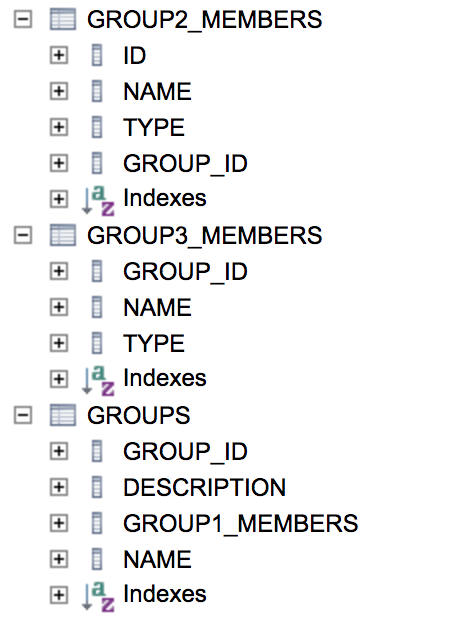

# ddd-value

## DB Schema



## Group

```java
public class Group {
    ...
    /**
     * ORM과 한 열로 직렬화되는 여러 값 : ORM and Many Values Serialized into a Single Column
     */
    @Convert(converter = GroupMembersConverter.class)
    @Column(name = "GROUP1_MEMBERS", length = 4000)
    private Set<GroupMember> group1Members = new HashSet<>();
    
    /**
     * ORM과 데이터베이스 엔터티로 지원되는 여러 값 : ORM and Many Values Backed by a Database Entity
     */
    @OneToMany(cascade = CascadeType.ALL, orphanRemoval = true)
    @JoinColumn(name = "GROUP_ID")
    private Set<IdentifiedGroupMember> group2Members = new HashSet<>();
    
    /**
     * ORM과 조인 테이블로 지원되는 여러 값 : ORM and Many Values Backed by a Join Table
     */
    @ElementCollection
    @CollectionTable(name = "GROUP3_MEMBERS", joinColumns = @JoinColumn(name = "GROUP_ID"))
    private Set<GroupMember> group3Members = new HashSet<>();
    ...
}
```
